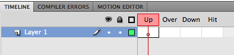
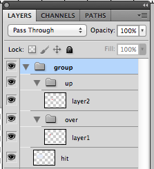

# JSX-CSS-Sprite
自動生成up、over狀態的 photoshop script 
測試環境: win/mac  CS5/CS6 

=============
> [About.me](http:about.me/eia) 

在Flash裡,我們會用 'up'、'over'、'hit'來製作按鈕元件， 

小工具使用類似方式命名群組與圖層名 

1: 選定包含 'up'、'over'、'hit' 三個圖層名稱的群組 
2: 執行 "jsx-css-sprite.jsx" 

   會依據 hit 作為 CSS Sprite 範圍的依據， 
   複製一份群組到新增檔案， 
   並將up 與 over 狀態垂直排列成 CSS Sprite 

=============
> 'up'、'over'、'hit' 不區分大小寫

=============
執行方式: 
方法1: File > Scripts > Browse... 選擇 "jsx-css-sprite.jsx" 
方法2: 將 "jsx-css-sprite.jsx" 存檔於 "/Presets/Scripts/ 中， 
      並使用 File > Scripts > jsx-css-sprite.jsx 執行 
      可設定快捷鍵